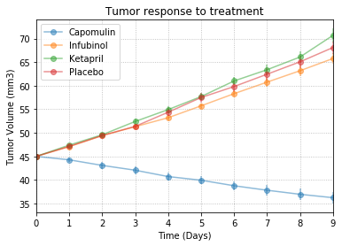
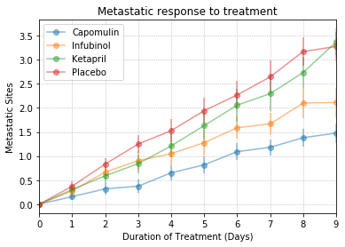
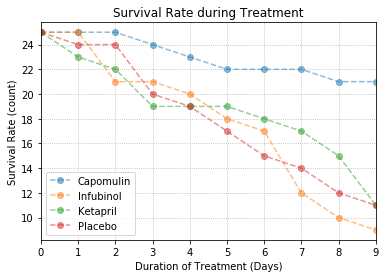

```python
import matplotlib.pyplot as plt
import numpy as np
import pandas as pd

from scipy.stats import sem
```


```python
clinical=pd.read_csv('raw_data/clinicaltrial_data.csv')
mouse=pd.read_csv('raw_data/mouse_drug_data.csv')
drug_list=['Capomulin', 'Infubinol', 'Ketapril', 'Placebo']


```


```python
#Creating a line chart that shows how the tumor volume changes over time for each treatment
data_merged_pre=pd.merge(clinical,mouse,on='Mouse ID')
data_merged=data_merged_pre[data_merged_pre['Drug'].isin(drug_list)]

tumor_response=data_merged[['Timepoint','Tumor Volume (mm3)','Drug']]
tumor_response=tumor_response.groupby(['Drug','Timepoint'])
tumor_response_df=pd.DataFrame(tumor_response['Tumor Volume (mm3)'].mean())
tumor_response_df=tumor_response_df.reset_index()
tumor_response_df=tumor_response_df.pivot(index='Timepoint',columns='Drug')
tumor_response_df.columns=drug_list
tumor_response_df=tumor_response_df.reset_index()

#Error bars
x_axis=np.arange(0,len(tumor_response_df['Timepoint']))
tumor_response_err=pd.DataFrame(tumor_response['Tumor Volume (mm3)'].sem())
tumor_response_err=tumor_response_err.reset_index()
tumor_response_err=tumor_response_err.pivot(index='Timepoint',columns='Drug')
tumor_response_err.columns=drug_list
tumor_response_err=tumor_response_err.reset_index()

#tumor_response_df.plot.scatter(x='Timepoint',y='Timepoint')
tumor_response_df.iloc[:,1:].plot(yerr=tumor_response_err, marker='o',style='s--',alpha=0.5)
plt.title("Tumor response to treatment")
plt.xlabel("Time (Days)")
plt.ylabel("Tumor Volume (mm3)")
plt.grid(linestyle='dotted')

plt.show()
```





```python
#Creating a line chart that shows how the number of metastatic
#sites changes over time for each treatment.

metastatic_response=data_merged[['Timepoint','Metastatic Sites','Drug']]

metastatic_response=metastatic_response.groupby(['Drug','Timepoint'])
metastatic_response_df=pd.DataFrame(metastatic_response['Metastatic Sites'].mean())
metastatic_response_df=metastatic_response_df.reset_index()
metastatic_response_df=metastatic_response_df.pivot(index='Timepoint',columns='Drug')
metastatic_response_df.columns=drug_list
metastatic_response_df=metastatic_response_df.reset_index()

#Error bars
x_axis=np.arange(0,len(metastatic_response_df['Timepoint']))
metastatic_response_err=pd.DataFrame(metastatic_response['Metastatic Sites'].sem())
metastatic_response_err=metastatic_response_err.reset_index()
metastatic_response_err=metastatic_response_err.pivot(index='Timepoint',columns='Drug')
metastatic_response_err.columns=drug_list
metastatic_response_err=metastatic_response_err.reset_index()

metastatic_response_df.iloc[:,1:].plot(yerr=metastatic_response_err, marker='o',style='s--',alpha=0.5)
plt.title("Metastatic response to treatment")
plt.xlabel("Duration of Treatment (Days)")
plt.ylabel("Metastatic Sites")
plt.grid(linestyle='dotted')
plt.show()

```





```python
#Creating a line chart that shows the number of mice still alive through the course of treatment

survival_rate=data_merged[['Timepoint','Mouse ID','Drug']]

survival_rate=survival_rate.groupby(['Drug','Timepoint'])
survival_rate_df=pd.DataFrame(survival_rate['Mouse ID'].count())
survival_rate_df=survival_rate_df.reset_index()
survival_rate_df=survival_rate_df.pivot(index='Timepoint',columns='Drug')
survival_rate_df.columns=drug_list
survival_rate_df=survival_rate_df.reset_index()

survival_rate_df.iloc[:,1:].plot(marker='o',style='s--',alpha=0.5)
plt.title("Survival Rate during Treatment")
plt.xlabel("Duration of Treatment (Days)")
plt.ylabel("Survival Rate (count)")
plt.grid(linestyle='dotted')
plt.show()

```





```python
#Creating a bar graph that compares the total % tumor 
#volume change for each drug across the full 45 days.
tumor_response_perc=pd.DataFrame(columns=['Drug','Start Volume','End Volume','Change'])
tumor_response_perc['Drug']=drug_list
tumor_response_perc['Start Volume']=tumor_response_df.iloc[0,1:].values
tumor_response_perc['End Volume']=tumor_response_df.iloc[9,1:].values
tumor_response_perc['Change']=round(((tumor_response_perc['End Volume']-tumor_response_perc['Start Volume'])/tumor_response_perc['Start Volume'])*100,2)

x_axis=np.arange(0,len(tumor_response_perc['Drug']))
y_axis=tumor_response_perc['Change']

plt.figure(figsize=(5,3))
plt.bar(x_axis, y_axis, color='r', alpha=0.5, align="edge")

tick_locations = [value+0.4 for value in x_axis]
plt.xticks(tick_locations, tumor_response_perc['Drug'],rotation=45)
plt.xlim(-0.25, len(x_axis))
plt.ylim(-50, 100)

plt.title("Tumor Volume Changes over the course of treatment")
plt.ylabel("Tumor Volume Change (in %)")
plt.hlines(0, 0, 10, alpha=0.7)

plt.show()
```


